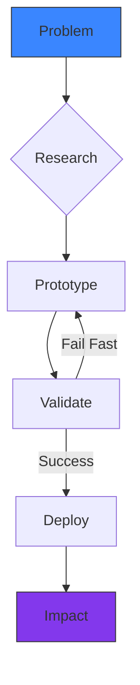

<!-- Animated Gradient Header -->
<div align="center">
  
  <h1 align="center">Daris Sojan</h1>
  <h3 align="center">
    🌊 AI Engineer • 🎯 Computer Vision • 🖥 Full-Stack Developer
  </h3>
</div>

<!-- Floating Tech Orb Animation -->
<div align="center">
  
</div>

---

## 🚀 Innovation Manifesto


> I architect AI systems that see, think, and act — bridging sensors to solutions with neural networks and elegant code.

---

## 🏆 Honors & Awards
<div align="center">
  
</div>

- 🥇 **ICTAK TECHATHLON 2025** — AI-powered Healthcare Solution  
- 🥇 **EDEN 4.0 Hackathon** — Best Computer Vision Implementation  
- 🥉 **Gen AI Hackathon** — Most Innovative NLP Application  
- 🏆 **INNOVISION 2k25** — Top Engineering Project  

---

## 🛠 Technical Arsenal
<div align="center">
  
</div>

**Core Languages**
```
Python ████████████████████ 95%  
C++    ██████████████ 70%  
SQL    ████████████████ 80%  
JS/TS  ███████████████ 75%
```

**AI Specializations**
```
TensorFlow/PyTorch  ██████████████████ 90%  
OpenCV/YOLO         ██████████████████ 90%  
NLP Transformers    ███████████████ 75%  
ONNX/TensorRT       ███████████ 60%
```

---

## 📌 Signature Projects
<div align="center">
  
</div>

**1. Neural Sentinel – Advanced Surveillance AI**  
  
Real-time threat detection combining gait analysis, object tracking, and anomaly prediction.

**2. CuraBot – Healthcare Conversational AI**  
  
End-to-end patient management system with prescription OCR and emergency triage.  
[🔗 View Project](https://github.com/daris-sojan/Cura-bot)

**3. DeepForge – Automated ML Platform**  
  
No-code environment for computer vision model training and deployment.

---

## 🌐 Digital Presence
<div align="center">
  <a href="https://www.linkedin.com/in/daris-sojan-45b493272/">
    
  </a>
  <a href="https://github.com/daris-sojan">
    
  </a>
  <a href="mailto:darissojan@gmail.com">
    
  </a>
  <a href="https://daris-sojan.github.io/daris-sojan/">
    
  </a>
</div>

<!-- Animated Footer -->
<div align="center">
  
</div>
